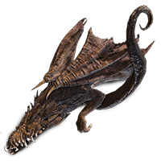

```{r message=FALSE, warning=FALSE}
library(dplyr)
library(ape)
library(Biostrings)
```

# Import Nexus Data
```{r}
DragonNexus <- read.nexus.data("./input/DragonMatrix.nex")
head(DragonNexus)
```
```{r}
names(DragonNexus)
```

# Distance Matrix
```{r}
DragonNexusDF <- data.frame(matrix(unlist(DragonNexus), ncol = 78, byrow = T))
row.names(DragonNexusDF) <- names(DragonNexus)
head(DragonNexusDF)
```
```{r}
DragonDist <- dist(DragonNexusDF,method = 'binary')
```
```{r}
DragonDistMat <- as.matrix(DragonDist)
```

## Visualize the Matrix
```{r message=FALSE, warning=FALSE}
library(reshape2)
library(ggplot2)
library(ggtree)
```

### trait weightings
```{r}
WeightsDat <- read.csv("./input/Weights.csv")
```

```{r}
Weights <- paste0(WeightsDat$Weight, collapse = "")
Weights <- strsplit(Weights, split= "")[[1]]
```

```{r}
WeightsNum <- rep(NA, length(Weights))

for(i in 1:length(WeightsNum)){
  if(Weights[i] %in% LETTERS){
    WeightsNum[i] <- which(LETTERS == Weights[i]) + 9
  } else {
    WeightsNum[i] <- Weights[i]
  }
}

WeightsNum <- as.numeric(WeightsNum)
```

```{r}
# multiply the weight value by the trait vector for each dragon
WtDragonNexus <- DragonNexus # Make a new weighted data frame object

for (i in 1:length(DragonNexus)){
  RepWeight <- DragonNexus[[i]] == 1
  WtDragonNexus[[i]][RepWeight] <- WeightsNum[RepWeight]
  RepWeight <- NA
}
```

```{r}
# re-calculate the distance matrix
WtDragonNexusDF <- data.frame(matrix(unlist(WtDragonNexus), ncol = 78,byrow = T))
row.names(WtDragonNexusDF) <- names(WtDragonNexus)
WtDragonDist <- dist(WtDragonNexusDF, method = 'euclidean')
```

```{r}
WtDragonDistMat <- as.matrix(WtDragonDist)
```

```{r}
# rearrange the data from an n×n matrix to a n2×3 matrix
WtPDat <- melt(WtDragonDistMat)

# plot the matrix
ggplot(data = WtPDat, aes(x = Var1, y = Var2, fill = value)) + 
  geom_tile() + 
  scale_fill_gradientn(colours = c("white","blue","green","red")) +
  theme(axis.text.x = element_text(angle = 90, hjust = 1, vjust = 0.5))
```

# Dragon Phylogeny
## Tree Building
```{r}
WtDragonTreeNJ <- nj(WtDragonDist)
```

```{r}
# check 'tip.labels'
head(WtDragonTreeNJ$tip.label)
```

```{r}
# remove leading numbers
Country <- gsub("[0-9\\.]+([^X]+)X*","\\1", WtDragonTreeNJ$tip.label)

# replace the unwanted '3' with 'Unknown'
Country <- gsub("\\d", "Unknown", Country)

# group 'tip.labels' by their corresponding country
CountryGroups <- split(WtDragonTreeNJ$tip.label, Country)

names(CountryGroups)
```

```{r}
# use the groupOTU function to apply the grouping information for plotting
WtDTcol <- groupOTU(WtDragonTreeNJ, CountryGroups)
```

## Visualize the Phylogenetic Tree
```{r fig.cap="Phylogenetic tree of dragons. The three dragons of choice (Sisu labeled as Raya, the grafted dragon labeled as EldenRin, and Velkhana) are highlighted in blue."}
# again use the groupOTU function to highlight the selected three groups
WtDTcolHi <- groupOTU(WtDTcol, c(CountryGroups$Raya, CountryGroups$EldenRin, CountryGroups$Velkhana))
ggtree(WtDTcolHi, layout = "circular", aes(color = group)) + 
  geom_tiplab(size = 1.8, aes(angle = angle)) +
  scale_colour_manual(name = "Dragon Type", 
                      values = c("Black", "Blue"), 
                      labels = c("Other Dragon", "My Dragon"))

```

# Report

Sisu (Figure 2) is the last dragon of Kumandra. She is a long, blue, spindly looking dragon with short dorsal fins on her back, and possesses a mane of white-bluish-violet hair. Except for a antlers horn type, her tail is shaped like Split Y.
```{r, echo=FALSE, out.width="40%", fig.cap="Sisu. Credit to mintmovi3: https://www.deviantart.com/mintmovi3/art/Raya-and-the-Last-Dragon-2021-Sisu-png-875599741", fig.align = 'center'}
knitr::include_graphics("./images/raya.png")
```
The grafted dragon (Figure 3), from the Elden Ring, belongs to Enia at Roundtable Hold, holding the embodiment of Godrick's power in its head.
```{r, echo=FALSE, out.width="40%", fig.cap="Grafted Dragon in Elden Ring. Credit to Hidetaka Miyazaki: https://rankedboost.com/elden-ring/grafted-dragon/", fig.align = 'center'}

```
Besides, Velkhana (Figure 4) is an elder dragon with the power to freeze all in its path. While simply looking at the appearance of the dragons of choice, Velkhana and the grafted dragon share great similarity, especially in wing type and toe morphology.
```{r, echo=FALSE, out.width="40%", fig.cap="Velkhana in Monster Hunter World Iceborne. Credit to Hironobu Takeshita: https://monsterhunter.fandom.com/wiki/Velkhana", fig.align = 'center'}
knitr::include_graphics("./images/Velkhana.png")
```
However, once take the evolving rate of different traits among dragons, according the the phylogenetic tree (Figure 1), all these three dragons are closely related; in particular, Sisu and Velkhana have the most recent ancestor.

	


